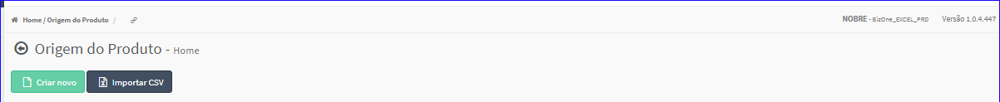

Importar CSV
############
- Essa opção é chamada através do botão **Importar CSV** da tela principal do Cadastro de Origens.

|imagem0|

- Após clicar no botão, o sistema irá abrir uma tela para escolher o local o novo arquivo.

