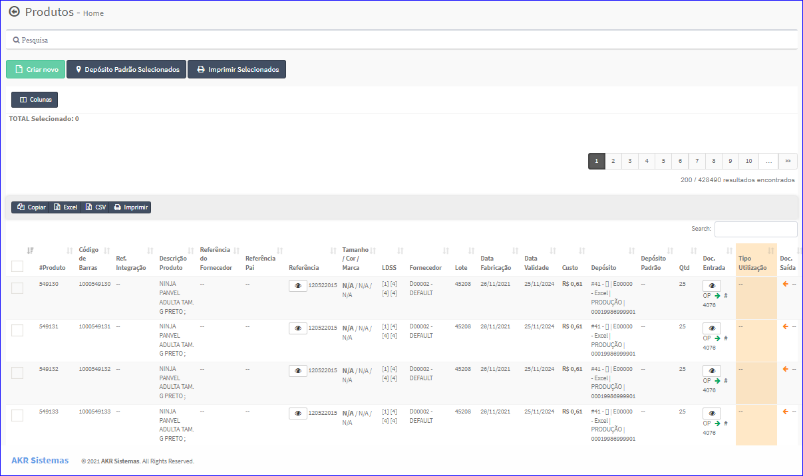
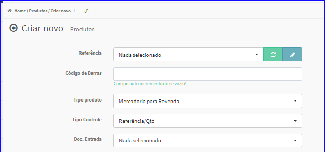
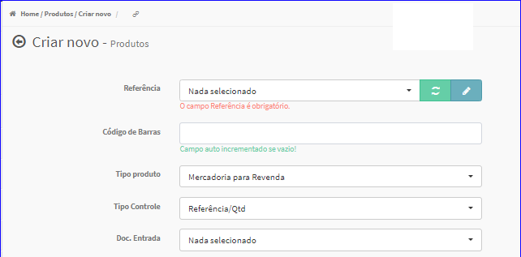
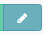
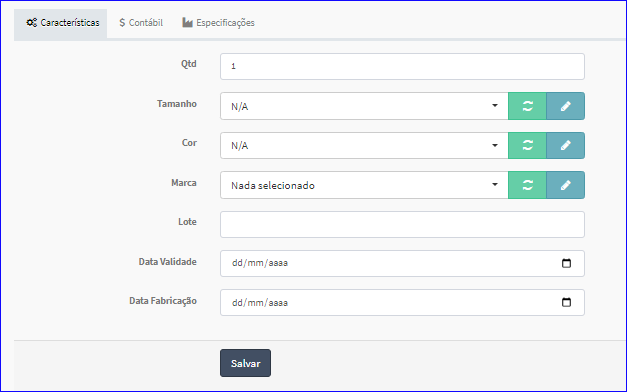
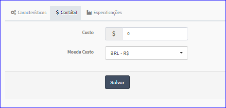
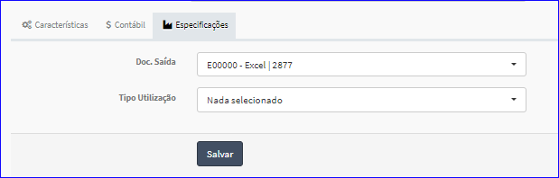

Criar Produtos
##############
- Permite gerar um novo Produto.

- Essa opção é chamada através do botão **Criar Novo** da tela principal do Cadastro de Grupos.

|imagem4|

- Após clicar no botão, o sistema irá abrir uma nova tela para a criação do cadastro.

|imagem30|
   * `Criar Referência <criar_referencia_produtos.html#section>`__
      - Essa opção é chamada através do botão |imagem33| que está à direita do ComboBox Referência.
   * O sistema valida os dados informados pelo usuário.
   * Caso não forem informados corretamente, são exibidas as mensagens.

|imagem31|

- **Características**

|imagem34|
   * Permite cadastrar as características do produto quanto:
      + Quantidade;
      + `Tamanho <criar_tamanho_produtos.html#section>`__;
         - Essa opção é chamada através do botão |imagem33| que está à direita do ComboBox Tamanho.
      + `Cor <criar_cor_produtos.html#section>`__;
         - Essa opção é chamada através do botão |imagem33| que está à direita do ComboBox Cor.
      + `Marca <criar_marca_produtos.html#section>`__;
         - Essa opção é chamada através do botão |imagem33| que está à direita do ComboBox Marca.
      + Lote;
      + Data de Validade;
      + Data de Fabricação.

- **Contábil**

|imagem35|
   * Preço de Custo;
   * Moeda.

- **Especificações**

|imagem36|
   * Documento de Saída;
   * Tipo de Utilização.

* Após informado corretamente os dados e clicado em **Salvar**, o sistema automaticamente voltará para a tela principal do Cadastro.

