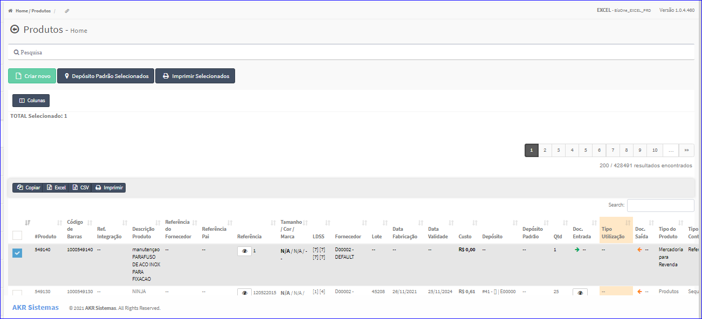
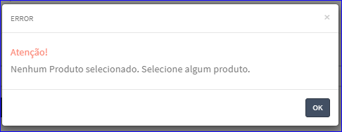
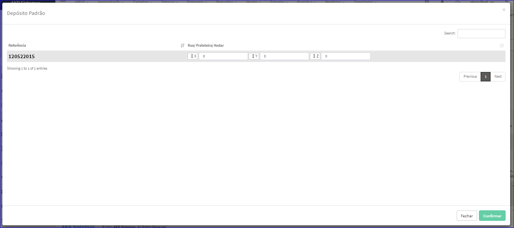

Depósito Padrão Selecionados
############################
- A tela Principal do Cadastro permite que o usuário selecione alguns produtos da lista e os defina com Depósito Padrão.

- Para isso, basta selecionar um(ns) Produto(s) da Lista e clicar no botão **Depósito Padrão Selecionados**.

|imagem5|
   - `Funções da Lista <lista_produtos.html#section>`__
   - Após o sistema irá abrir uma nova tela com o(s) Produto(s) escolhido(s) anteriormente.   

|imagem9|
   - O botão **Alterar** irá atualizar todas as modificações efetuadas.
   - O usuário deverá então definir Rua/Prateleira/Andar e após clicar em **Confirmar**.

- Caso o usuário tente selecionar o Depósito Padrão sem ter marcado produtos, o sistema informará com uma mensagem.

|imagem8|

