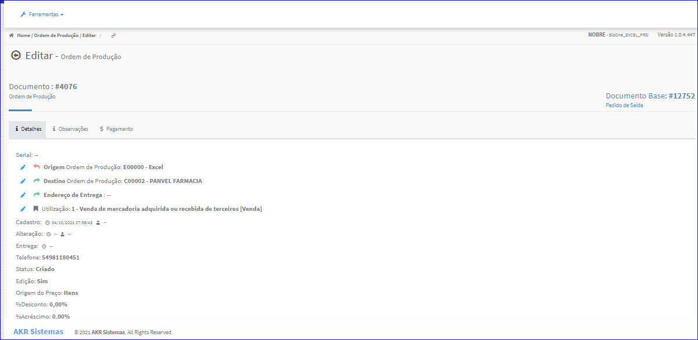
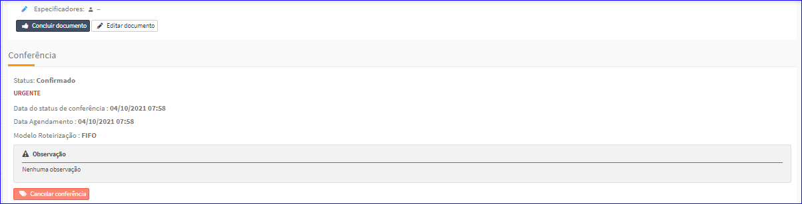
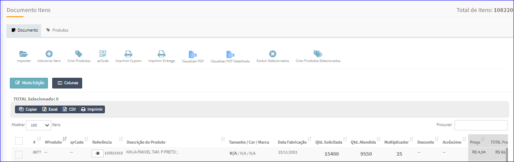

Editar Documentos de Entrada/Saída
##################################
- A tela da Edição permite efetuar operações relacionadas aos Documentos de Entrada e Saída do Produto.

- Esta tela é chamada através da Lista dos Produtos exibida na tela principal do Cadastro.
- Para isso, basta selecionar um Produto da Lista e clicar no ícone da coluna **Doc. Entrada** ou **Doc. Saída**.

|imagem4|
   - `Funções da Lista <lista_produtos.html#section>`__
   - Após o sistema irá abrir uma nova tela com a Documento de Entrada ou Saída do Produto escolhido anteriormente.   

|imagem13|
|imagem15|
|imagem16|

