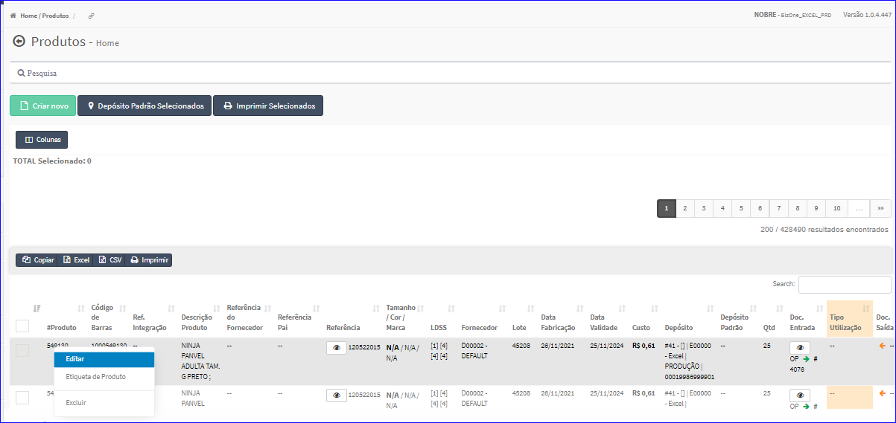
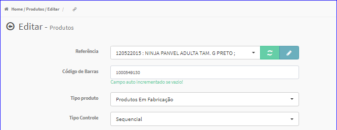

Editar Produtos
###############
- A tela da Edição permite alterar os dados de um Produto.

- Esta tela é chamada através da Lista dos Produtos exibida na tela principal do Cadastro.
- Para isso, basta selecionar um Produto da Lista e clicar com o botão direito do mouse e escolher a opção **Editar**.

|imagem17|
   - `Funções da Lista <lista_produtos.html#section>`__
   - Após o sistema irá abrir uma nova tela com o Produto escolhido anteriormente.   

|imagem18|

- **Características**

|imagem34|
   * Permite cadastrar as características do produto quanto:
      + Quantidade;
      + `Tamanho <criar_tamanho_produtos.html#section>`__;
         - Essa opção é chamada através do botão |imagem33| que está à direita do ComboBox Tamanho.
      + `Cor <criar_cor_produtos.html#section>`__;
         - Essa opção é chamada através do botão |imagem33| que está à direita do ComboBox Cor.
      + `Marca <criar_marca_produtos.html#section>`__;
         - Essa opção é chamada através do botão |imagem33| que está à direita do ComboBox Marca.
      + Lote;
      + Data de Validade;
      + Data de Fabricação.

- **Contábil**

|imagem35|
   * Preço de Custo;
   * Moeda.

- **Especificações**

|imagem36|
   * Documento de Saída;
   * Tipo de Utilização.

- O botão **Alterar** irá atualizar todas as modificações efetuadas.

.. |imagem34| image:: imagens/Produtos_34.png

.. |imagem35| image:: imagens/Produtos_35.png

.. |imagem36| image:: imagens/Produtos_36.png
