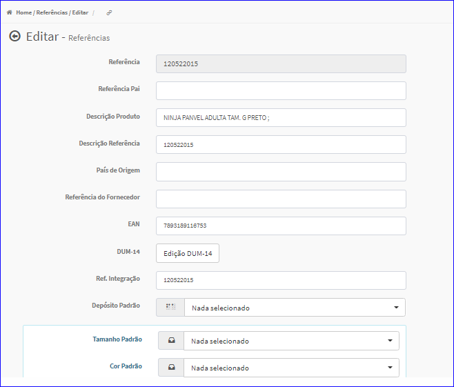
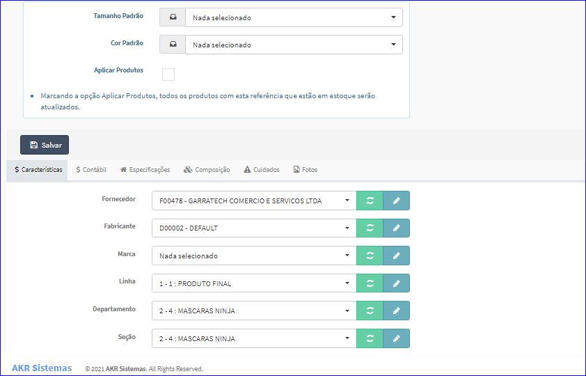

Editar Referência
#################
- A tela da Edição permite alterar os dados da Referência de um determinado Produto.

- Esta tela é chamada através da Lista dos Produtos exibida na tela principal do Cadastro.
- Para isso, basta selecionar um Produto da Lista e clicar no ícone da coluna **Referência**.

|imagem4|
   - `Funções da Lista <lista_produtos.html#section>`__
   - Após o sistema irá abrir uma nova tela com a Referência do Produto escolhido anteriormente.   

|imagem11|
|imagem12|
   - O botão **Salvar** irá atualizar todas as modificações efetuadas.

.. |imagem4| image:: imagens/Produtos_4.png

