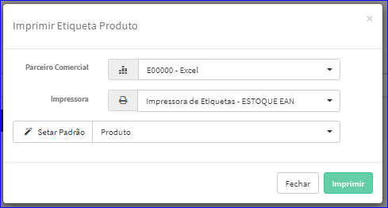
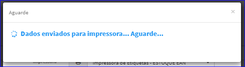
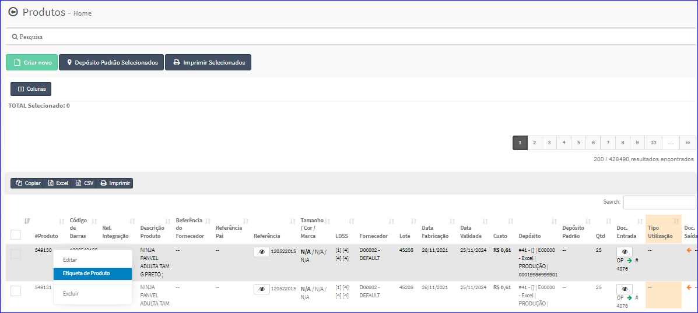

Etiqueta de Produto
###################
- A tela Principal do Cadastro permite que o usuário selecione um produto da lista para a impressão de etiquetas.

- Para isso, basta selecionar um Produto da Lista e clicar com o botão direito do mouse e escolher a opção **Etiqueta de Produto**.

|imagem26|
   - `Funções da Lista <lista_produtos.html#section>`__
   - Após o sistema irá abrir uma nova tela para a definição do Parceiro Comercial, Impressora e o parâmetro Padrão para que a impressão possa ser efetuada.

|imagem6|
   - O botão **Imprimir** efetuar a impressão dos dados.

|imagem7|

- Caso o usuário tente Imprimir Etiquetas sem ter marcado produtos, o sistema informará com uma mensagem.

|imagem8|

.. |imagem8| image:: imagens/Produtos_8.png

