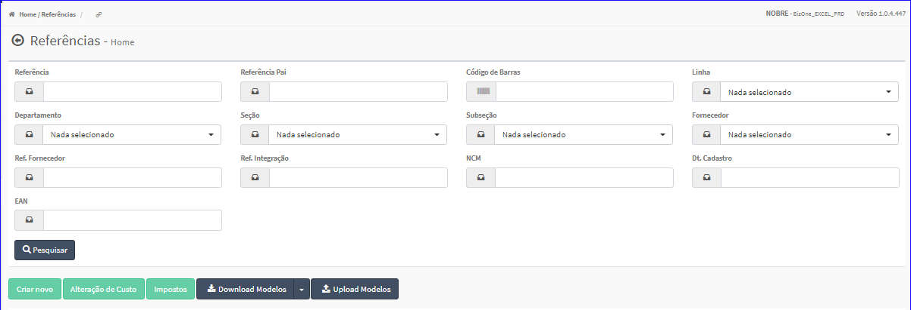
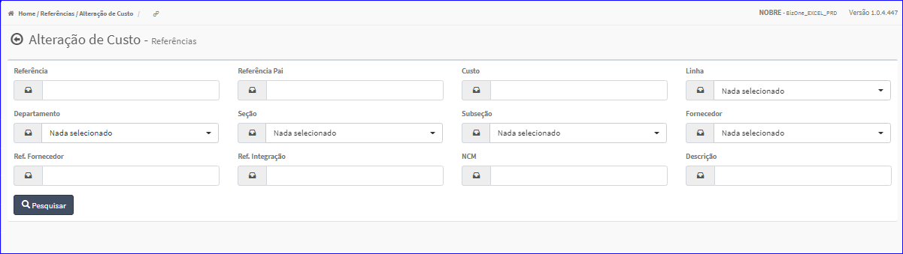

Alteração de Custo
##################
- Essa opção é chamada através do botão **Alteração de Custo** da tela principal do Cadastro de Referências.

|imagem1a|

- Após clicar no botão, o sistema irá abrir uma nova tela para efetuar pesquisa pelo Custo da Referência.

|imagem5|

