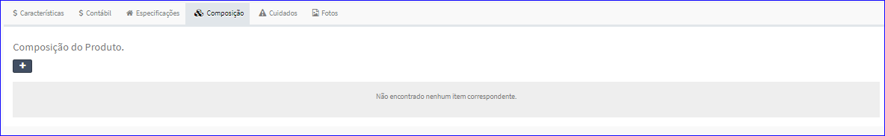
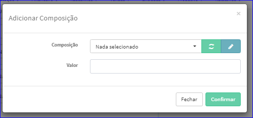
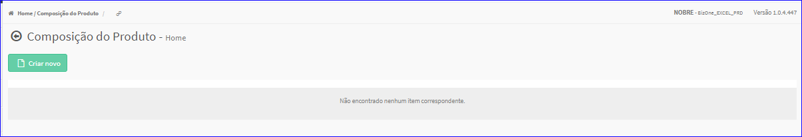
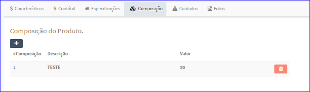
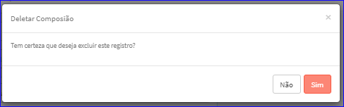

Composição
##########
- Permite adicionar Composições de um Produto à Referência.

|imagem33|
   - Referência sem Composições.
   - O botão **+** abrirá uma tela para incluir uma composição.

|imagem34|
   - O sistema ainda permite abrir a tela do **Cadastro de Composição do Produto** através do botão |imagem51| que está à direita do ComboBox Composição.

|imagem35|

|imagem36|
   - Referência com Composições.
   - O usuário ainda poderá excluir a composição através do ícone da lixeira contida na lista.
   
|imagem36a|

.. |imagem51| image:: imagens/Referencias_51.png
