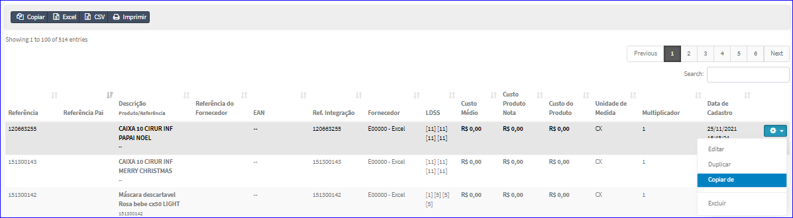
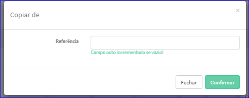

Copiar de Referência
####################
- A tela do Cadastro permite Copiar os dados de uma Referência.

- Esta tela é chamada através da Lista das Referências exibida na tela principal do Cadastro.
- Para isso, basta selecionar uma Referência da Lista e clicar com o botão direito do mouse e escolher a opção **Copiar de**.

|imagem46|
   - `Funções da Lista <lista_referencia.html#section>`__
   - Após o sistema irá abrir uma nova tela para copiar a Referência.

|imagem47|
   - O botão **Confirmar** irá atualizar os dados.

