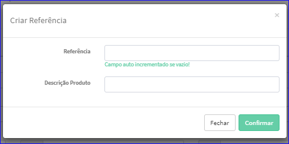

Criar Referência
################
- Permite gerar uma nova Referência.

- Essa opção é chamada através do botão **Criar Novo** da tela principal do Cadastro de Referências.

|imagem1a|

- Após clicar no botão, o sistema irá abrir uma nova tela para a criação do cadastro.

|imagem4|
   * Após informado corretamente os dados e clicado em **Confirmar**, o sistema abrirá a tela de Edição.

.. |imagem1a| image:: imagens/Referencias_1a.png

