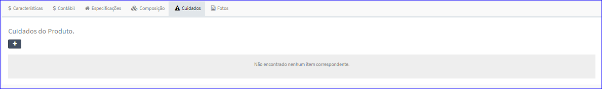
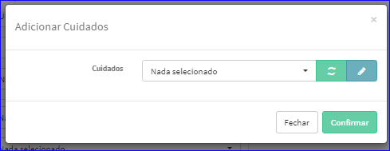
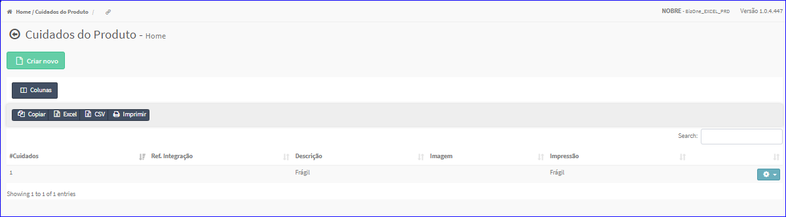
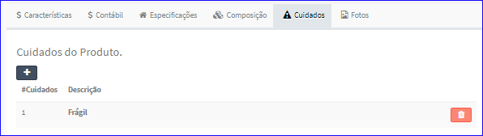
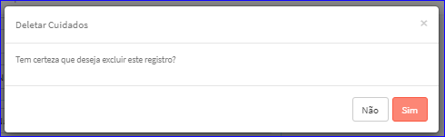

Cuidados
########
- Permite adicionar Cuidados de um Produto à Referência.

|imagem37|
   - Referência sem Cuidados.
   - O botão **+** abrirá uma tela para incluir um cuidado.

|imagem38|
   - O sistema ainda permite abrir a tela do **Cadastro de Cuidados do Produto** através do botão |imagem51| que está à direita do ComboBox Cuidados.

|imagem39|

|imagem40|
   - Referência com Cuidados.
   - O usuário ainda poderá excluir o cuidado através do ícone da lixeira contida na lista.
   
|imagem41|

.. |imagem51| image:: imagens/Referencias_51.png
