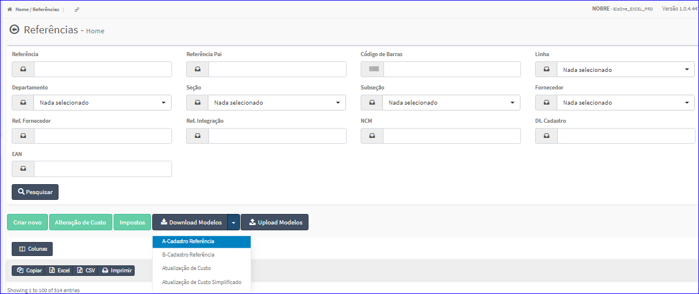

Download Modelos - A-Cadastro Referência
########################################
- Essa opção é chamada através do botão **Download Modelos A-Cadastro Referência** da tela principal do Cadastro de Referências.

|imagem7|

- Após clicar no botão, o sistema irá abrir uma tela para escolher o local onde será salvo o modelo.

|imagem8|

.. |imagem8| image:: imagens/Referencias_8.png
