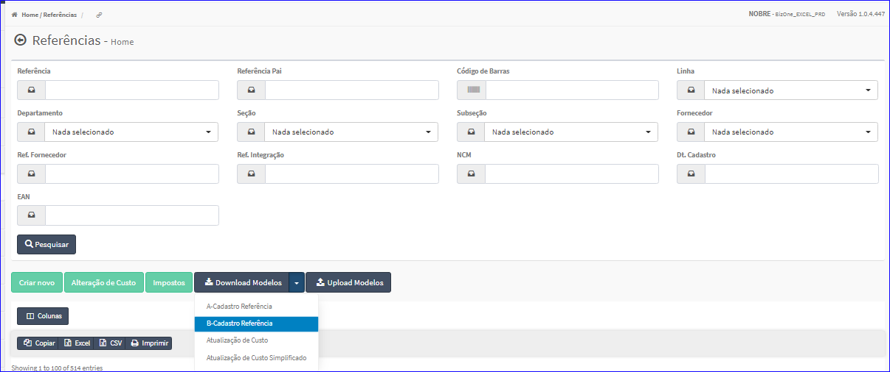
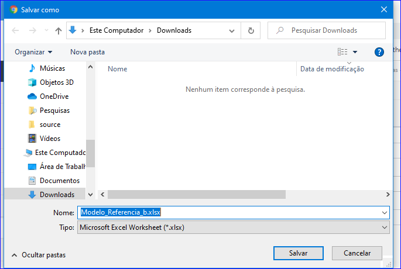

Download Modelos - B-Cadastro Referência
########################################
- Essa opção é chamada através do botão **Download Modelos B-Cadastro Referência** da tela principal do Cadastro de Referências.

|imagem9|

- Após clicar no botão, o sistema irá abrir uma tela para escolher o local onde será salvo o modelo.

|imagem10|

