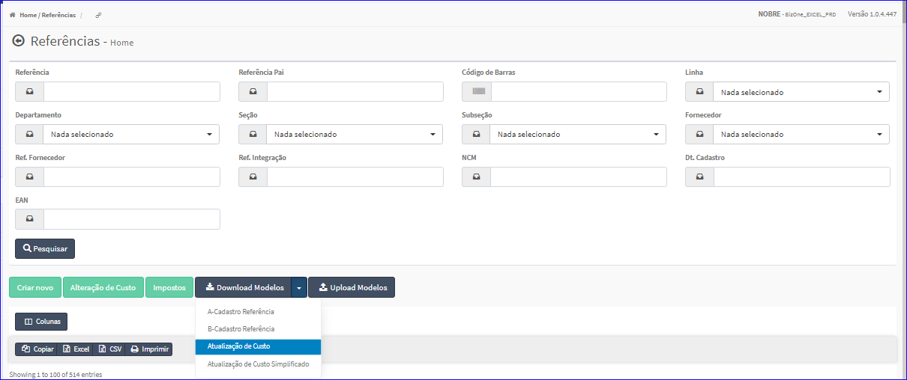
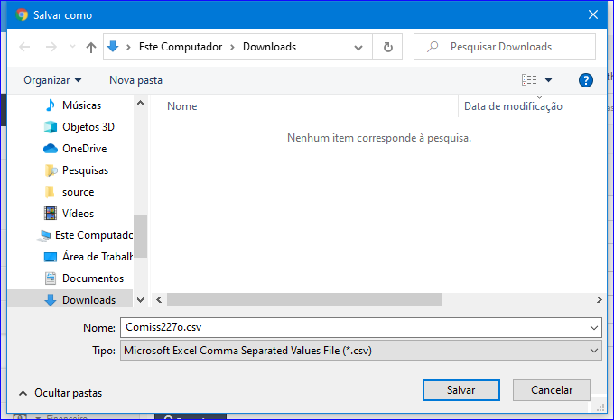

Download Modelos - Atualização de Custo
#######################################
- Essa opção é chamada através do botão **Download Modelos Atualização de Custo** da tela principal do Cadastro de Referências.

|imagem11|

- Após clicar no botão, o sistema irá abrir uma tela para escolher o local onde será salvo o modelo.

|imagem12|

