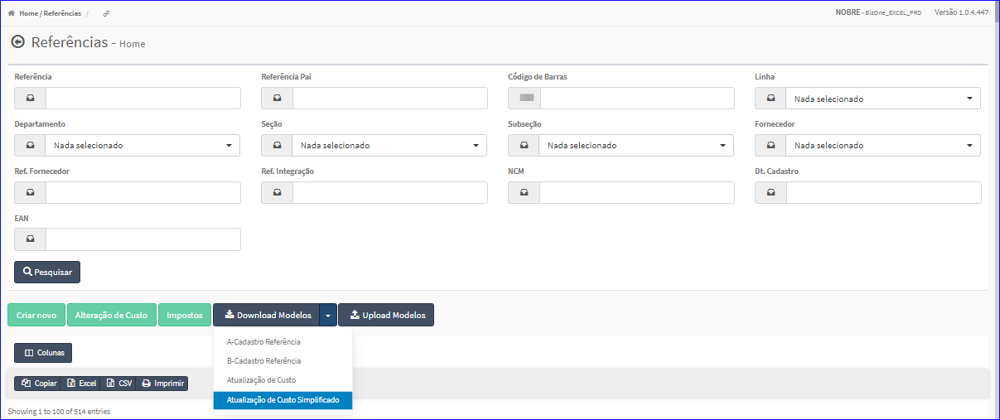
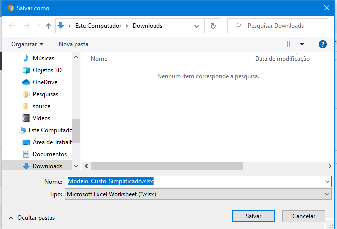

Download Modelos - Atualização de Custo Simplificado
####################################################
- Essa opção é chamada através do botão **Download Modelos Atualização de Custo Simplificado** da tela principal do Cadastro de Referências.

|imagem13|

- Após clicar no botão, o sistema irá abrir uma tela para escolher o local onde será salvo o modelo.

|imagem14|

