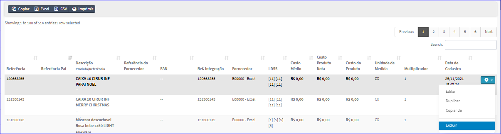
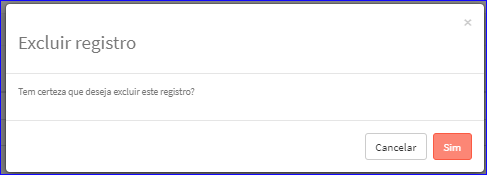

Excluir Referência
##################
- Esta opção é chamada através da Lista das Referências exibida na tela principal do Cadastro.
- Para isso, basta selecionar uma Referência da Lista e clicar com o botão direito do mouse e escolher a opção **Excluir**.

|imagem48|
   - `Funções da Lista <lista_parceiro_comercial.html#section>`__
   - Após escolhido a Referência o sistema irá questionar o usuário quanto ao registro.

|imagem49|
   - Depois de clicado em **Sim** o sistema atualizará a lista.

