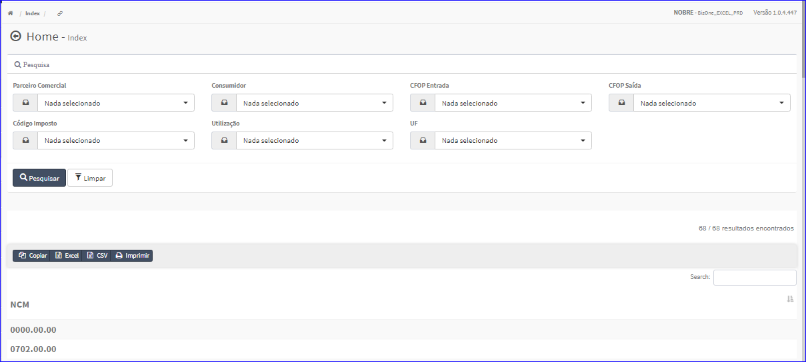

Impostos
########
- Essa opção é chamada através do botão **Impostos** da tela principal do Cadastro de Referências.

|imagem1a|

- Após clicar no botão, o sistema irá abrir uma nova tela para efetuar pesquisa pelo Imposto da Referência.

|imagem6|

.. |imagem1a| image:: imagens/Referencias_1a.png

