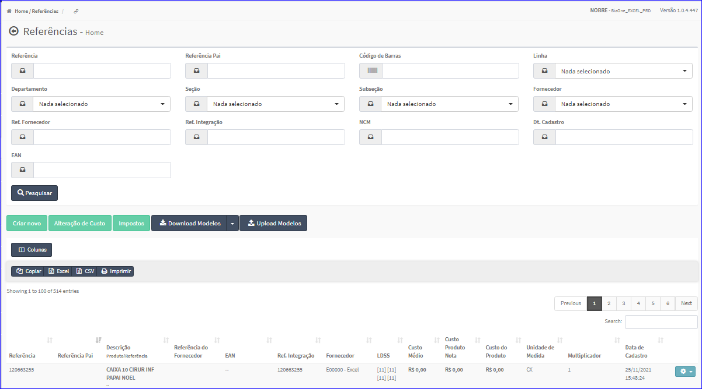

Referência
##########
- No Menu (Superior ou Esquerdo) acesse a opção **Cadastros -> Produtos -> Referência**.
   * O sistema irá apresentar uma tela conforme exemplo abaixo.

|imagem1a|
- Esta tela permite efetuar pesquisa utilizando os filtros:
   * Referência;
   * Referência Pai;
   * Código de Barras;
   * Linha;
   * Departamento;
   * Seção;
   * Subseção;
   * Fronecedor;
   * Referência Fornecedor;
   * Referência Integração;
   * NCM;
   * Data Cadastro;
   * EAN.
   
- Caso o usuário não queira informar nenhum filtro, basta clicar em **Pesquisar**.
   
- Os resultados serão apresentados conforme exemplo.

|imagem1|
   - `Funções da Lista <lista_referencia.html#section>`__

.. toctree::
   :maxdepth: 2

   criar_referencia
   editar_referencia
   excluir_referencia

.. |imagem1a| image:: imagens/Referencias_1a.png

