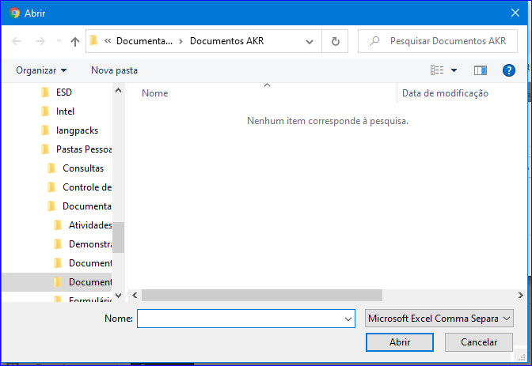
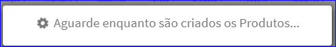

Upload Modelos
##############
- Essa opção é chamada através do botão **Upload Modelos** da tela principal do Cadastro de Referências.

|imagem15|

- Após clicar no botão, o sistema irá abrir uma tela para escolher o local o novo arquivo contendo o modelo.

|imagem16|
|imagem17|

.. |imagem15| image:: imagens/Referencias_15.png

