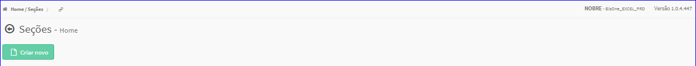

Seção
#####
- No Menu (Superior ou Esquerdo) acesse a opção **Cadastros -> Produtos -> Seção**.
   * O sistema irá apresentar uma tela conforme exemplo abaixo.

|imagem0|
   * Tela sem nenhuma seção cadastrada.

|imagem1|
   - Tela com seções cadastradas.
   - `Funções da Lista <lista_secao.html#section>`__

.. toctree::
   :maxdepth: 2

   criar_secao
   editar_secao
   excluir_secao

.. |imagem1| image:: imagens/Secao_1.png
