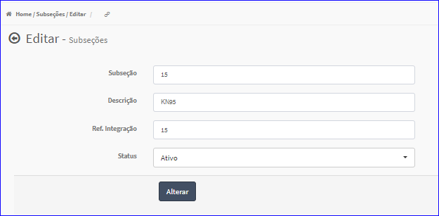

Editar Subseção
###############
- A tela da Edição permite alterar os dados de uma Subseção.

- Esta tela é chamada através da Lista das Subseções exibida na tela principal do Cadastro.
- Para isso, basta selecionar uma Subseção da Lista e ir até a Engrenagem situada à direita e escolher a opção **Editar**.

|imagem5|
   - `Funções da Lista <lista_subsecao.html#section>`__
   - Após o sistema irá abrir uma nova tela com a Subseção escolhida anteriormente.   

|imagem6|
   - O botão **Alterar** irá atualizar todas as modificações efetuadas.

.. |imagem7| image:: imagens/Subsecao_7.png
