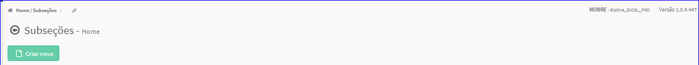

Subseções
#########
- No Menu (Superior ou Esquerdo) acesse a opção **Cadastros -> Produtos -> Subseção**.
   * O sistema irá apresentar uma tela conforme exemplo abaixo.

|imagem0|
   * Tela sem nenhuma subseção cadastrada.

|imagem1|
   - Tela com subseções cadastradas.
   - `Funções da Lista <lista_subsecao.html#section>`__

.. toctree::
   :maxdepth: 2

   criar_subsecao
   editar_subsecao
   excluir_subsecao

.. |imagem1| image:: imagens/Subsecao_1.png
