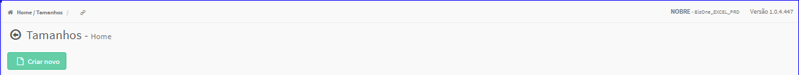
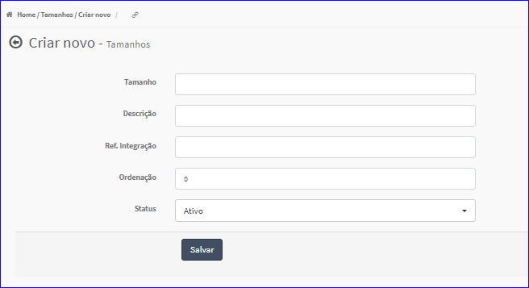

Criar Tamanho
#############
- Permite gerar um novo Tamanho de Produto.

- Essa opção é chamada através do botão **Criar Novo** da tela principal do Cadastro de Tamanhos.

|imagem0|

- Após clicar no botão, o sistema irá abrir uma nova tela para a criação do cadastro.

|imagem4|
   * Após informado corretamente os dados e clicado em **Salvar**, o sistema voltará para a tela de cadastro e atualizará a lista dos Tamanhos.

