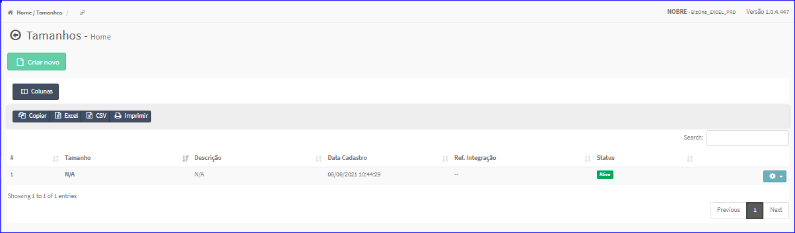

Tamanhos
########
- No Menu (Superior ou Esquerdo) acesse a opção **Produtos -> Tamanho**.
   * O sistema irá apresentar uma tela conforme exemplo abaixo.

|imagem1|
   - `Funções da Lista <lista_produtos.html#section>`__

.. toctree::
   :maxdepth: 2

   criar_tamanho
   editar_tamanho
   excluir_tamanho

