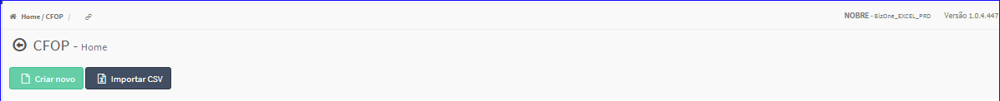
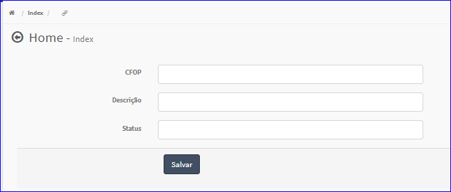
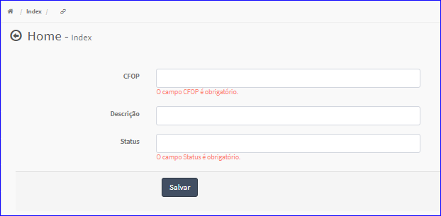

Criar CFOP
##########
- Permite a criação de um novo CFOP.

- Essa opção é chamada através do botão **Criar Novo** da tela principal do Cadastro de CFOP.

|imagem1|

- Após clicar no botão, o sistema irá abrir uma nova tela para a criação do cadastro.

|imagem5|

- Caso o usuário não informe corretamente os dados, o sistema exibirá mensagem.

|imagem6|

   * Após informado corretamente os dados e clicado em **Salvar**, o sistema atualizará a lista dos CFOP.

