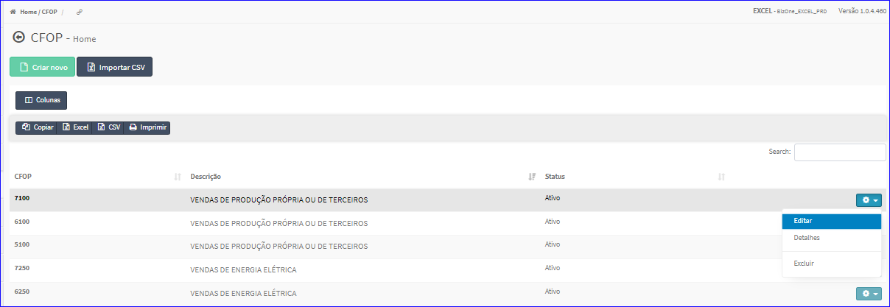

Editar CFOP
###########
- A tela da Edição permite alterar os dados de um CFOP.

- Esta tela é chamada através da Lista dos CFOP exibida na tela principal do Cadastro.
- Para isso, basta selecionar um CFOP da Lista e ir até a Engrenagem situada à direita e escolher a opção **Editar**.

|imagem9|
   - `Funções da Lista <lista_cfop.html#section>`__
   - Após o sistema irá abrir uma nova tela com o CFOP escolhido anteriormente.   

|imagem10|
   - Após alterados os dados e clicado em **Alterar**, o sistema atualizará a lista.

.. |imagem10| image:: imagens/CFOP_10.png
