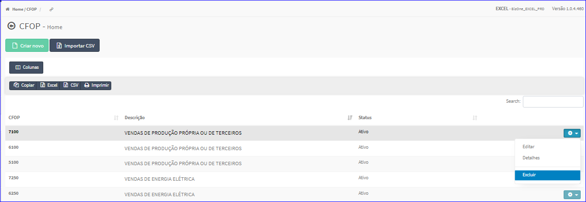
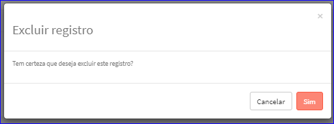

Excluir CFOP
############
- Esta opção é chamada através da Lista dos CFOPs exibida na tela principal do Cadastro.
- Para isso, basta selecionar um CFOP da Lista e ir até a Engrenagem situada à direita e escolher a opção **Excluir**.

|imagem12|
   - `Funções da Lista <lista_cfop.html#section>`__
   - Após escolhido o CFOP o sistema irá questionar o usuário quanto ao registro.

|imagem13|
   - Depois de clicado em **Sim** o sistema atualizará a lista.

