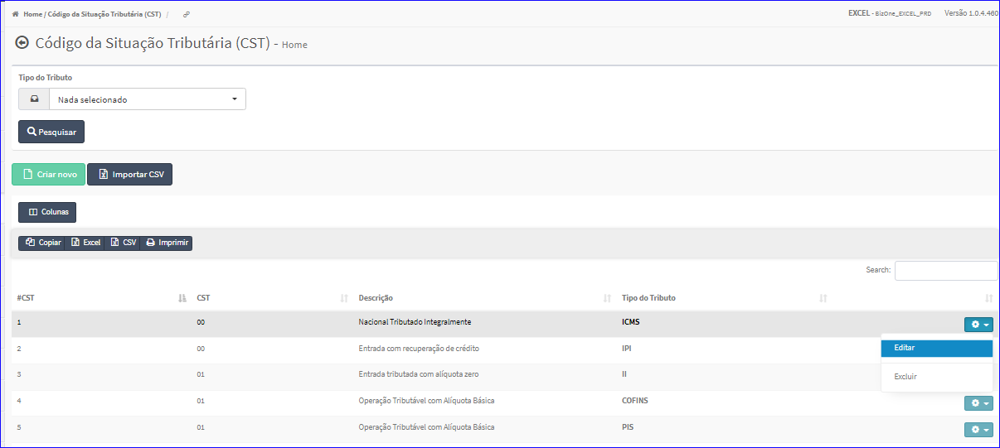

Editar CST
##########
- A tela da Edição permite alterar os dados de uma CST.

- Esta tela é chamada através da Lista das CST exibida na tela principal do Cadastro.
- Para isso, basta selecionar uma CST da Lista e ir até a Engrenagem situada à direita e escolher a opção **Editar**.

|imagem10|
   - `Funções da Lista <lista_cst.html#section>`__
   - Após o sistema irá abrir uma nova tela com a CST escolhida anteriormente.   

|imagem11|
   - Após alterados os dados e clicado em **Alterar**, o sistema atualizará a lista.

.. |imagem11| image:: imagens/CST_11.png
