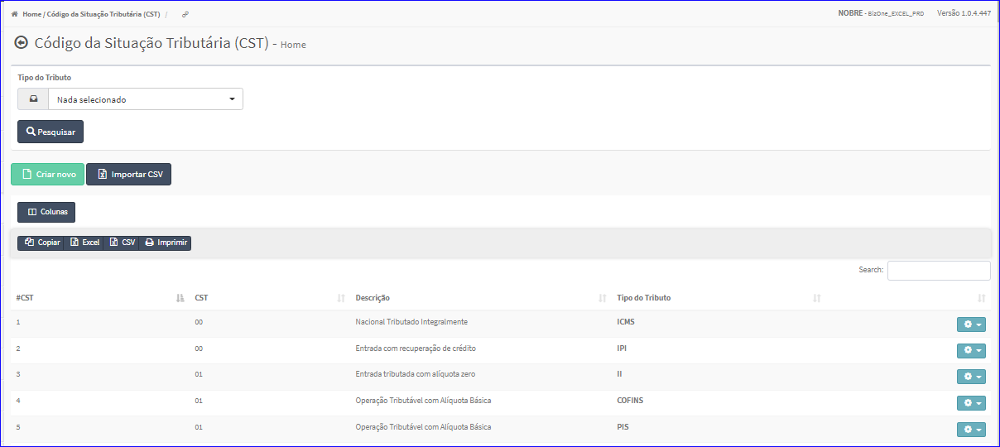
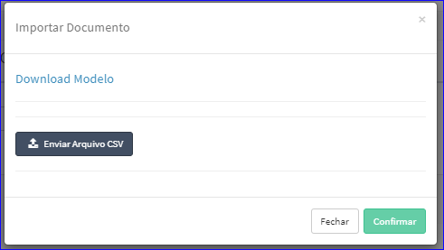
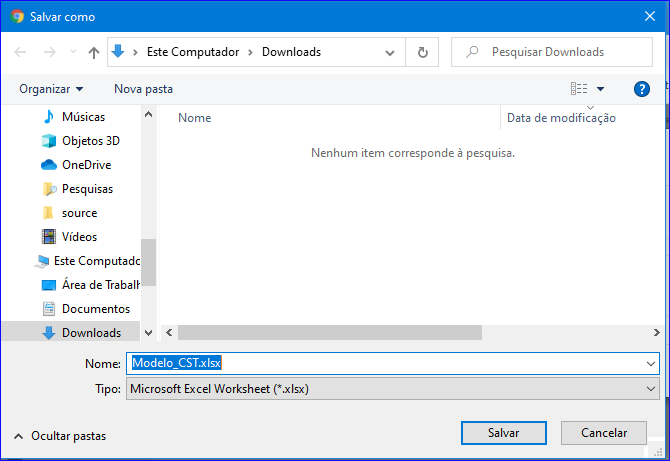

Importar CSV
############
- Permite importar modelo de CST.

- Essa opção é chamada através do botão **Importar CSV** da tela principal do Cadastro de Utilizações.

|imagem2|

- Após clicar no botão, o sistema irá abrir uma nova tela.

|imagem7|
   - **Download Modelo**
   - **Enviar Arquivo CSV**

      - Ambas opções abrirão uma tela para escolher um arquivo para baixar ou vincular os dados de uma CST.

|imagem8|

