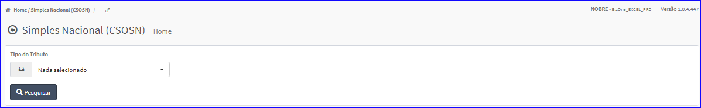
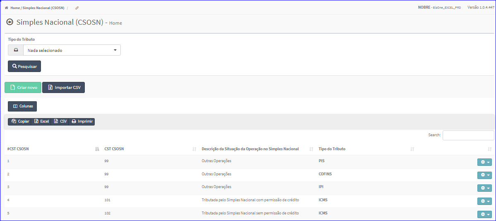

CST CSOSN
#########
No Menu (Superior ou Esquerdo) acesse a opção **Cadastros -> Tributação -> CST CSOSN**.
   * O sistema irá apresentar uma tela conforme exemplo abaixo.

|imagem1|
- Esta tela permite efetuar pesquisa utilizando os filtros:
   * Tipo do Tributo.
   
- Caso o usuário não queira informar nenhum filtro, basta clicar em **Pesquisar**.
   
- Os resultados serão apresentados conforme exemplo.

|imagem2|
   - `Funções da Lista <lista_cst_csosn.html#section>`__

.. toctree::
   :maxdepth: 2

   criar_cst_csosn
   editar_cst_csosn
   excluir_cst_csosn

