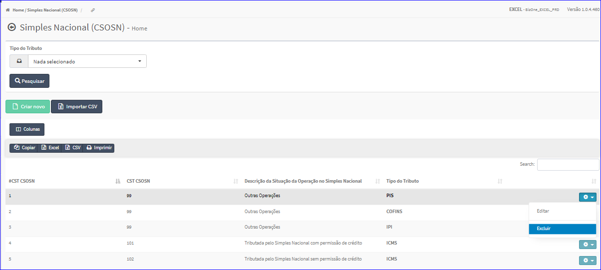
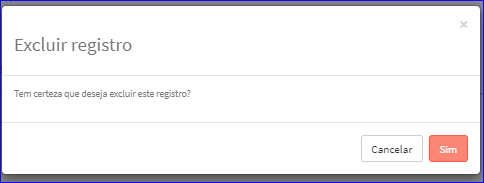

Excluir CST CSOSN
#################
- Esta opção é chamada através da Lista das CST CSOSN exibida na tela principal do Cadastro.
- Para isso, basta selecionar uma CST CSOSN da Lista e ir até a Engrenagem situada à direita e escolher a opção **Excluir**.

|imagem12|
   - `Funções da Lista <lista_cst_csosn.html#section>`__
   - Após escolhido a CST CSOSN o sistema irá questionar o usuário quanto ao registro.

|imagem13|
   - Depois de clicado em **Sim** o sistema atualizará a lista.

