Criar Imposto - Enquadramento NCM
#################################
   - Esta tela é chamada através da Lista dos Impostos de um Enquadramentos NCM na tela principal do Cadastro.
   - Para isso, basta selecionar um Imposto da Lista e clicar no botão **Adicionar Imposto**.

|imagem7|
   - Após o sistema irá abrir uma nova tela.

|imagem17|
|imagem18|
|imagem19|
   - Nesta tela de edição, o usuário poderá informar:
      - Status;
      - Dados;
      - Regra.

- Após alterados os dados e clicado em **Confirmar**, o sistema atualizará a lista.

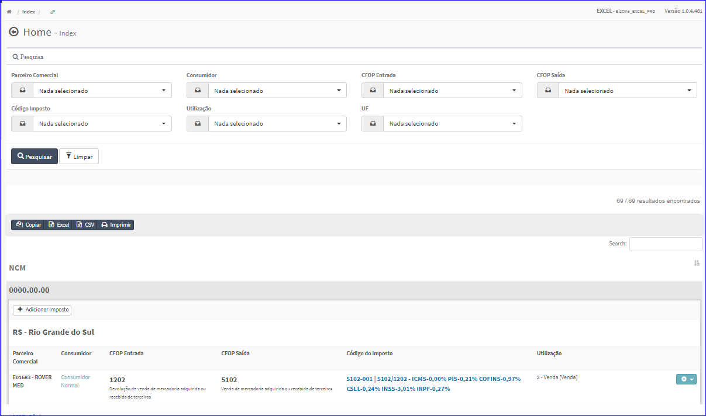

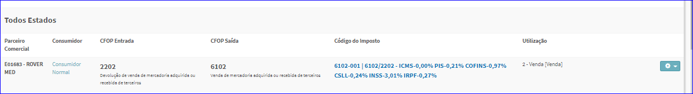

.. |imagem7| image:: imagens/Enquadramento_NCM_7.png

.. |imagem8| image:: imagens/Enquadramento_NCM_8.png

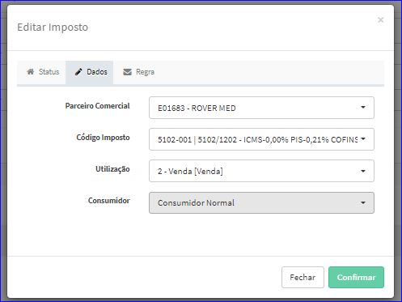

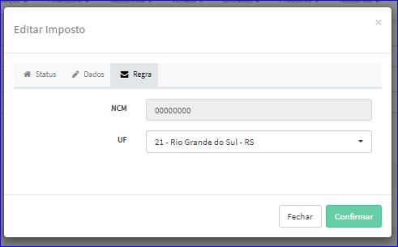

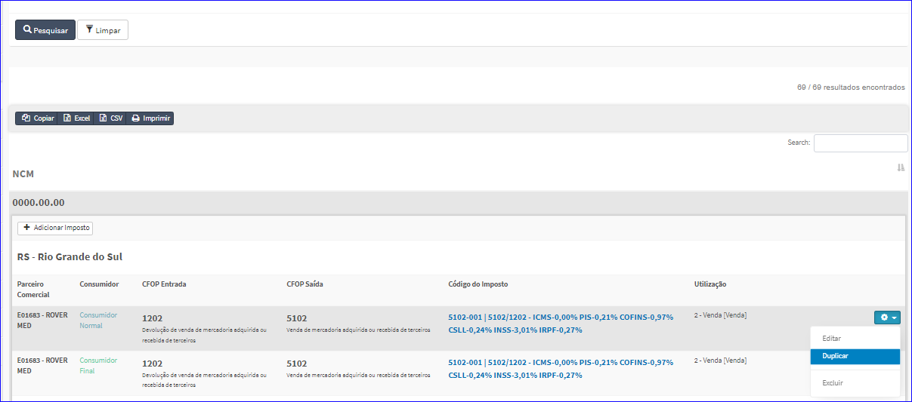

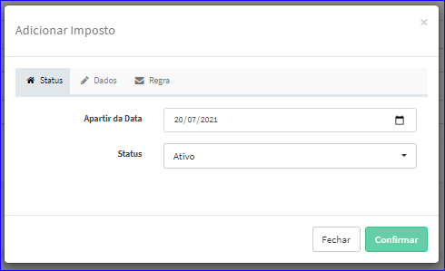

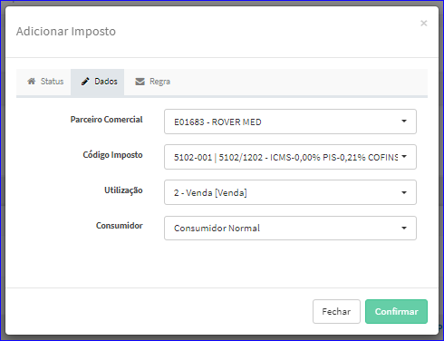

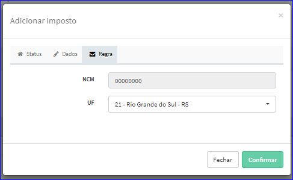

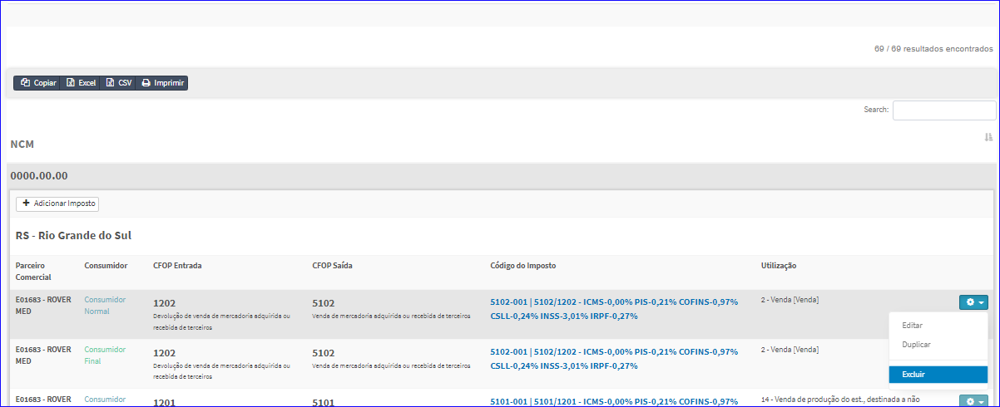

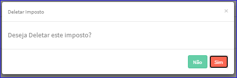

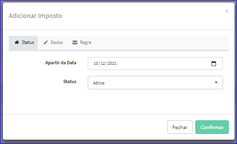

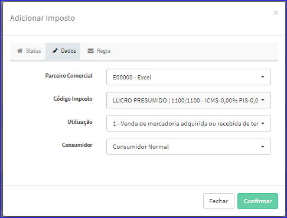

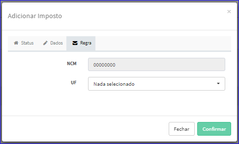

