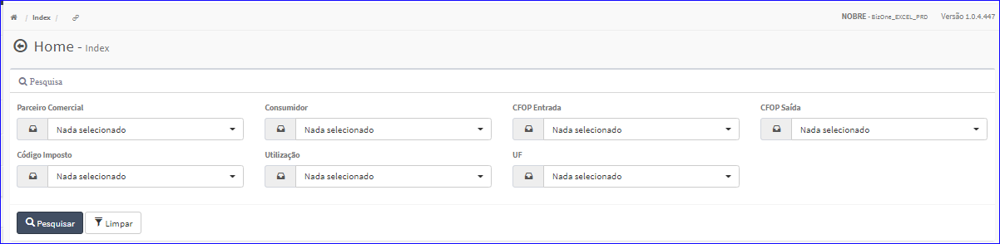
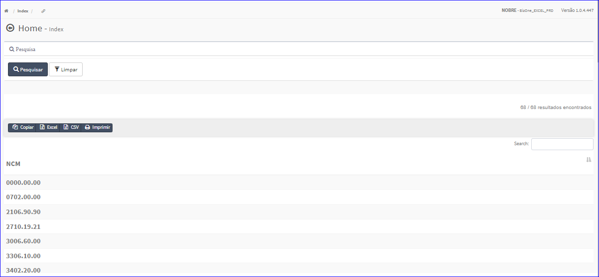

Enquadramento NCM
#################
No Menu (Superior ou Esquerdo) acesse a opção **Cadastros -> Tributação -> Enquadramento NCM**.
   * O sistema irá apresentar uma tela conforme exemplo abaixo.

|imagem1|
- Esta tela permite efetuar pesquisa utilizando os filtros:
   * Parceiro Comercial;
   * Consumidor;
   * CFOP Entrada;
   * CFOP Saída;
   * Código Imposto;
   * Utilização;
   * UF.
   
- Caso o usuário não queira informar nenhum filtro, basta clicar em **Pesquisar**.
   
- Os resultados serão apresentados conforme exemplo.

|imagem2|
   - `Funções da Lista <lista_enquadramento_ncm.html#section>`__

.. toctree::
   :maxdepth: 2

   criar_enquadramento_ncm
   editar_enquadramento_ncm
   excluir_enquadramento_ncm
   lista_enquadramento_ncm

