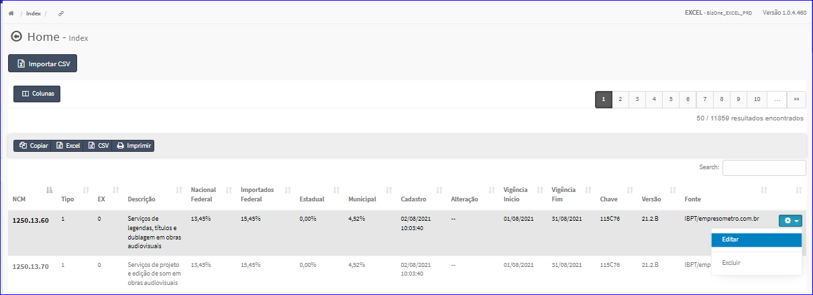
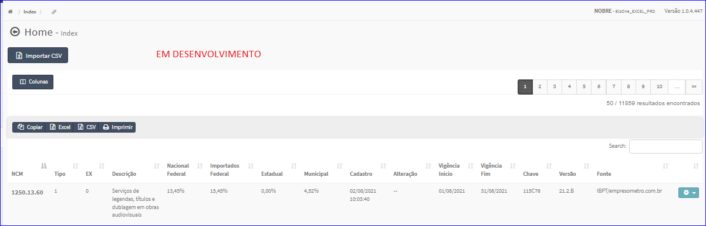

Editar IBPT
###########
- A tela da Edição permite alterar os dados de um IBPT.

- Esta tela é chamada através da Lista do IBPT exibida na tela principal do Cadastro.
- Para isso, basta selecionar um IBPT Lista e ir até a Engrenagem situada à direita e escolher a opção **Editar**.

|imagem8|
   - `Funções da Lista <lista_ibpt.html#section>`__
   - Após o sistema irá abrir uma nova tela com o IBPT Nacional escolhido anteriormente.   

|imagem9|

- Após alterados os dados e clicado em **Salvar**, o sistema atualizará a lista e voltará para a tela do cadastro principal.

