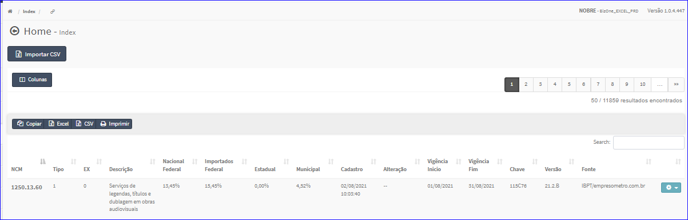
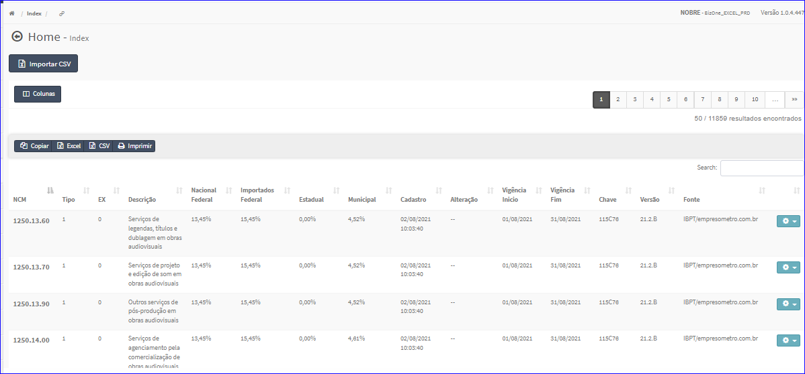

IBPT
####
No Menu (Superior ou Esquerdo) acesse a opção **Cadastros -> Tributação -> IBPT**.
   * O sistema irá apresentar uma tela conforme exemplo abaixo.

|imagem1|
   * Tela sem nenhum ibpt cadastrado.

|imagem2|
   - Tela com ibpt's cadastrados.
   - `Funções da Lista <lista_ibpt.html#section>`__

.. toctree::
   :maxdepth: 2

   importar_csv_ibpt
   editar_ibpt
   excluir_ibpt

