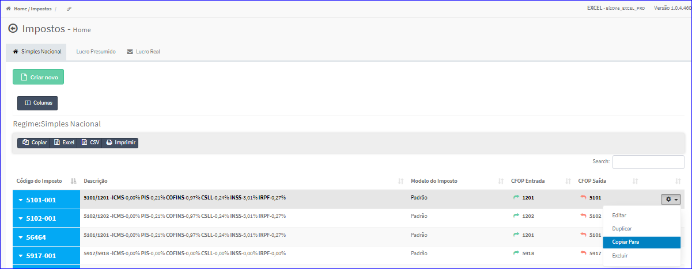
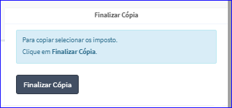

Copiar para Imposto - Simples Nacional
######################################
- Esta tela é chamada através da Lista dos Impostos Simples Nacional exibida na tela principal do Cadastro.
- Para isso, basta selecionar um Imposto Simples Nacional da Lista e ir até a Engrenagem situada à direita e escolher a opção **Copiar para**.

|imagem25|
   - `Funções da Lista <lista_impostos.html#section>`__
   - Após o sistema irá abrir uma nova tela.

|imagem26|
   - Após informados os impostos e clicado em **Finalizar Cópia**, o sistema atualizará a lista.

