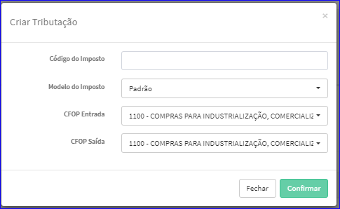
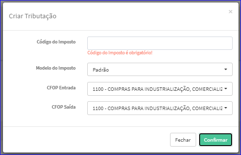

Criar Imposto - Lucro Presumido
###############################
- Permite a criação de um novo Imposto Lucro Presumido.

- Essa opção é chamada através do botão **Criar Novo** da tela principal do Cadastro de Impostos - Lucro Presumido.

|imagem7|

- Após clicar no botão, o sistema irá abrir uma nova tela para a criação do cadastro.

|imagem35|

- Caso o usuário não informe corretamente os dados, o sistema exibirá mensagem.

|imagem36|

   * Após informado corretamente os dados e clicado em **Confirmar**, o sistema atualizará a lista dos Impostos.

.. |imagem7| image:: imagens/Impostos_7.png

