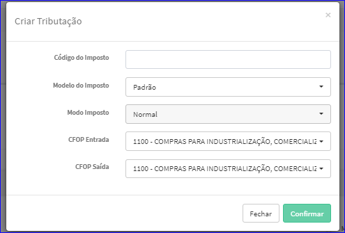
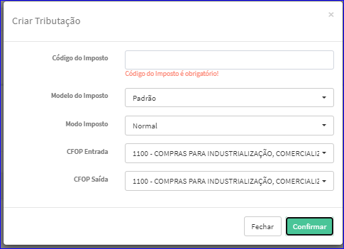

Criar Imposto - Simples Nacional
################################
- Permite a criação de um novo Imposto Simples Nacional.

- Essa opção é chamada através do botão **Criar Novo** da tela principal do Cadastro de Impostos - Simples Nacional.

|imagem1|

- Após clicar no botão, o sistema irá abrir uma nova tela para a criação do cadastro.

|imagem5|

- Caso o usuário não informe corretamente os dados, o sistema exibirá mensagem.

|imagem6|

   * Após informado corretamente os dados e clicado em **Confirmar**, o sistema atualizará a lista dos Impostos.

.. |imagem1| image:: imagens/Impostos_1.png

