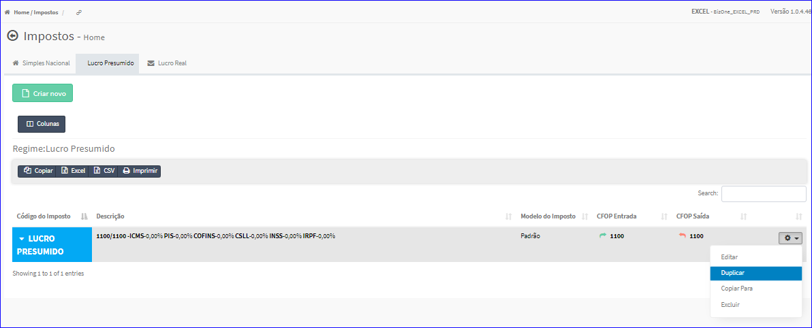
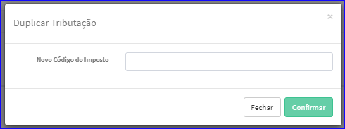

Duplicar Imposto - Lucro Presumido
##################################
- Esta tela é chamada através da Lista dos Impostos Lucro Presumido exibida na tela principal do Cadastro.
- Para isso, basta selecionar um Imposto Lucro Presumido da Lista e ir até a Engrenagem situada à direita e escolher a opção **Duplicar**.

|imagem39|
   - `Funções da Lista <lista_lucro_presumido_impostos.html#section>`__
   - Após o sistema irá abrir uma nova tela. 

|imagem40|
   - Após informados os dados e clicado em **Confirmar**, o sistema atualizará a lista.

