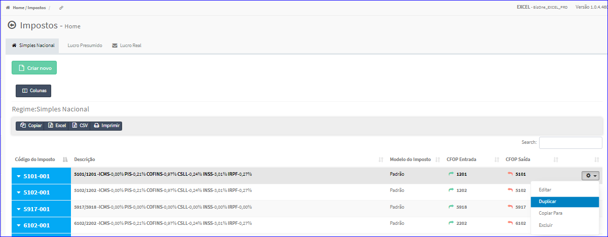
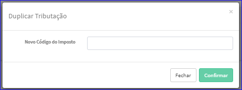

Duplicar Imposto - Simples Nacional
###################################
- Esta tela é chamada através da Lista dos Impostos Simples Nacional exibida na tela principal do Cadastro.
- Para isso, basta selecionar um Imposto Simples Nacional da Lista e ir até a Engrenagem situada à direita e escolher a opção **Duplicar**.

|imagem23|
   - `Funções da Lista <lista_impostos.html#section>`__
   - Após o sistema irá abrir uma nova tela. 

|imagem24|
   - Após informados os dados e clicado em **Confirmar**, o sistema atualizará a lista.

