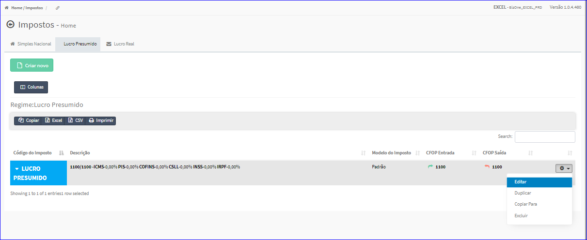

Editar Imposto - Lucro Presumido
################################
- A tela da Edição permite alterar os dados de um Imposto Lucro Presumido.

- Esta tela é chamada através da Lista dos Impostos Lucro Presumido exibida na tela principal do Cadastro.
- Para isso, basta selecionar um Imposto Lucro Presumido da Lista e ir até a Engrenagem situada à direita e escolher a opção **Editar**.

|imagem33|
   - `Funções da Lista <lista_lucro_presumido_impostos.html#section>`__
   - Após o sistema irá abrir uma nova tela com o Imposto Lucro Presumido escolhido anteriormente.   

|imagem34|
   - Após alterados os dados e clicado em **Confirmar**, o sistema atualizará a lista.

.. |imagem34| image:: imagens/Impostos_34.png
