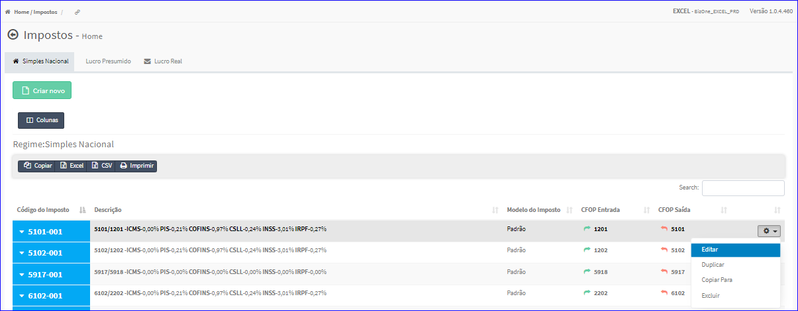
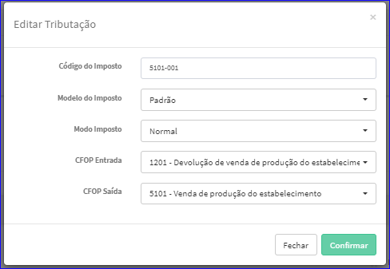

Editar Imposto - Simples Nacional
#################################
- A tela da Edição permite alterar os dados de um Imposto Simples Nacional.

- Esta tela é chamada através da Lista dos Impostos Simples Nacional exibida na tela principal do Cadastro.
- Para isso, basta selecionar um Imposto Simples Nacional da Lista e ir até a Engrenagem situada à direita e escolher a opção **Editar**.

|imagem19|
   - `Funções da Lista <lista_impostos.html#section>`__
   - Após o sistema irá abrir uma nova tela com o Imposto Simples Nacional escolhido anteriormente.   

|imagem20|
   - Após alterados os dados e clicado em **Confirmar**, o sistema atualizará a lista.

