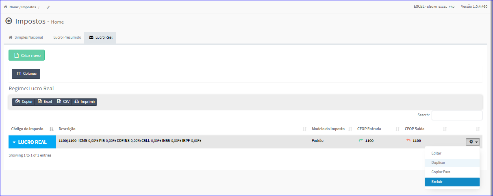
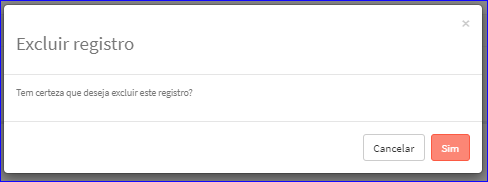

Excluir Imposto - Lucro Real
############################
- Esta opção é chamada através da Lista dos Impostos Lucro Real exibida na tela principal do Cadastro.
- Para isso, basta selecionar um Imposto Lucro Real da Lista e ir até a Engrenagem situada à direita e escolher a opção **Excluir**.

|imagem59|
   - `Funções da Lista <lista_lucro_real_impostos.html#section>`__
   - Após escolhido o Imposto o sistema irá questionar o usuário quanto ao registro.

|imagem60|
   - Depois de clicado em **Sim** o sistema atualizará a lista.

