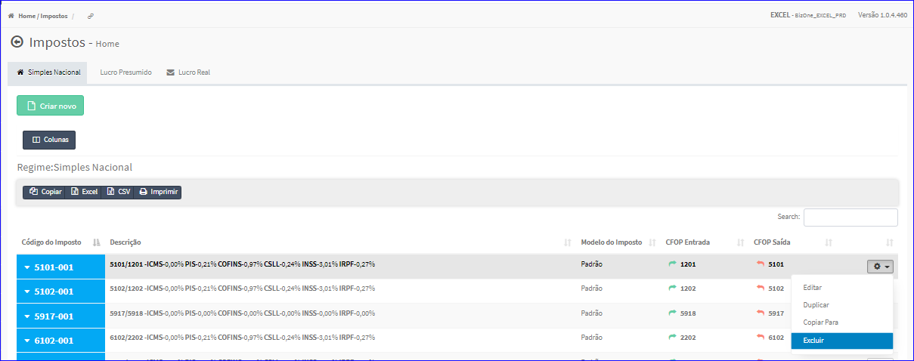
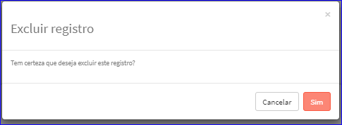

Excluir Imposto - Simples Nacional
##################################
- Esta opção é chamada através da Lista dos Impostos Simples Nacional exibida na tela principal do Cadastro.
- Para isso, basta selecionar um Imposto Simples Nacional da Lista e ir até a Engrenagem situada à direita e escolher a opção **Excluir**.

|imagem21|
   - `Funções da Lista <lista_impostos.html#section>`__
   - Após escolhido o Imposto o sistema irá questionar o usuário quanto ao registro.

|imagem22|
   - Depois de clicado em **Sim** o sistema atualizará a lista.

