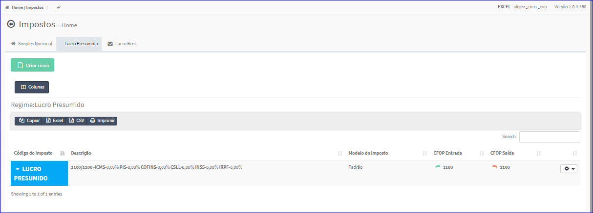

Impostos - Lucro Presumido
##########################
* O sistema irá apresentar telas conforme exemplo abaixo.

|imagem7|
   * Tela sem nenhum imposto cadastrado.

|imagem7a|
   - Tela com impostos cadastrados.
   - `Funções da Lista <lista_lucro_presumido_impostos.html#section>`__

.. toctree::
   :maxdepth: 2

   tipo_lp_impostos
   criar_lp_impostos
   editar_lp_impostos
   duplicar_lp_impostos
   copiar_para_lp_impostos
   excluir_lp_impostos

.. |imagem7| image:: imagens/Impostos_7.png

