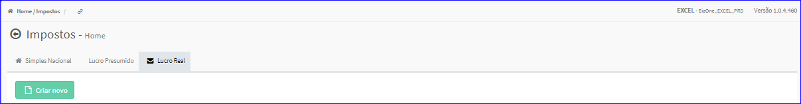
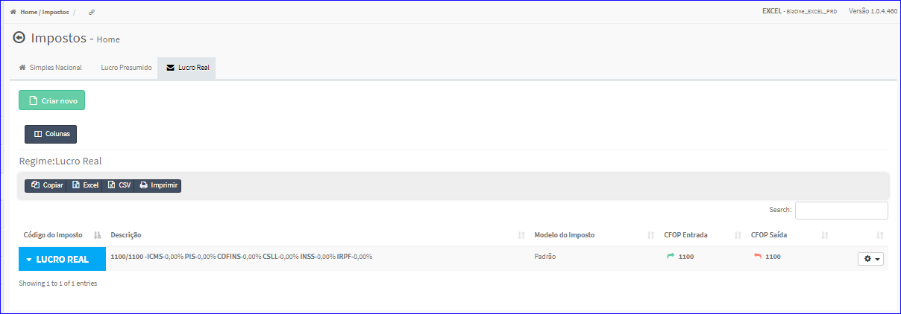

Impostos - Lucro Real
#####################
* O sistema irá apresentar telas conforme exemplo abaixo.

|imagem8|
   * Tela sem nenhum imposto cadastrado.

|imagem8a|
   - Tela com impostos cadastrados.
   - `Funções da Lista <lista_lucro_real_impostos.html#section>`__

.. toctree::
   :maxdepth: 2

   tipo_lr_impostos
   criar_lr_impostos
   editar_lr_impostos
   duplicar_lr_impostos
   copiar_para_lr_impostos
   excluir_lr_impostos

