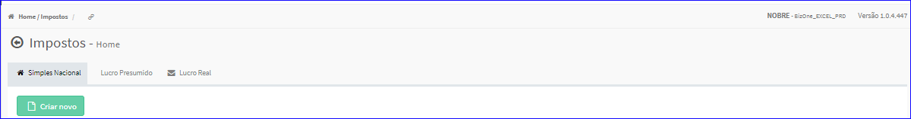
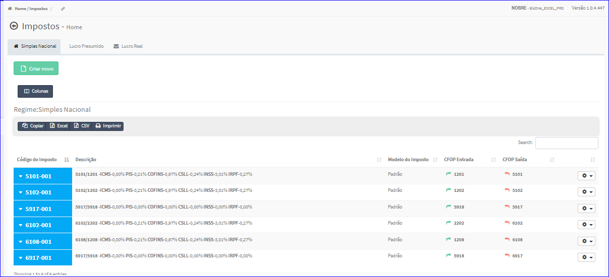

Impostos - Simples Nacional
###########################
* O sistema irá apresentar telas conforme exemplo abaixo.

|imagem1|
   * Tela sem nenhum imposto cadastrado.

|imagem2|
   - Tela com impostos cadastrados.
   - `Funções da Lista <lista_impostos.html#section>`__

.. toctree::
   :maxdepth: 2

   tipo_sn_impostos
   criar_sn_impostos
   editar_sn_impostos
   duplicar_sn_impostos
   copiar_para_sn_impostos
   excluir_sn_impostos

