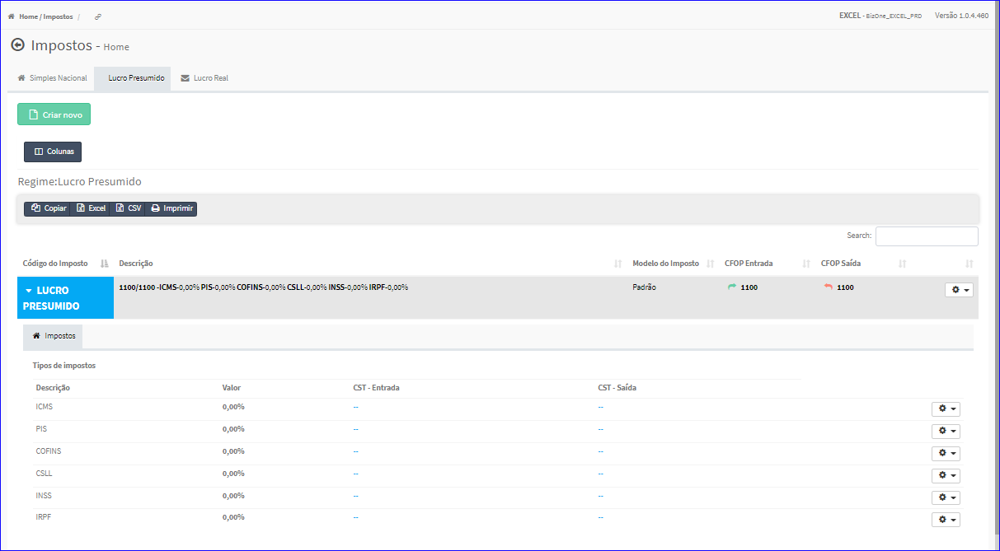
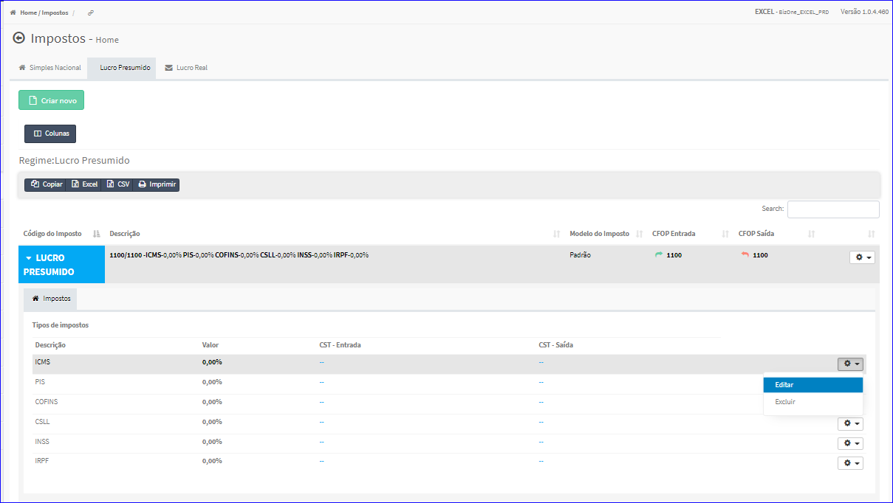
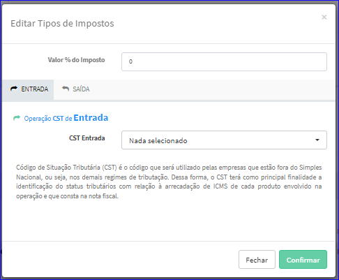
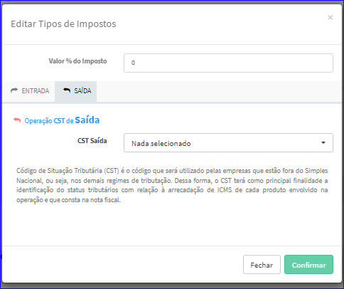
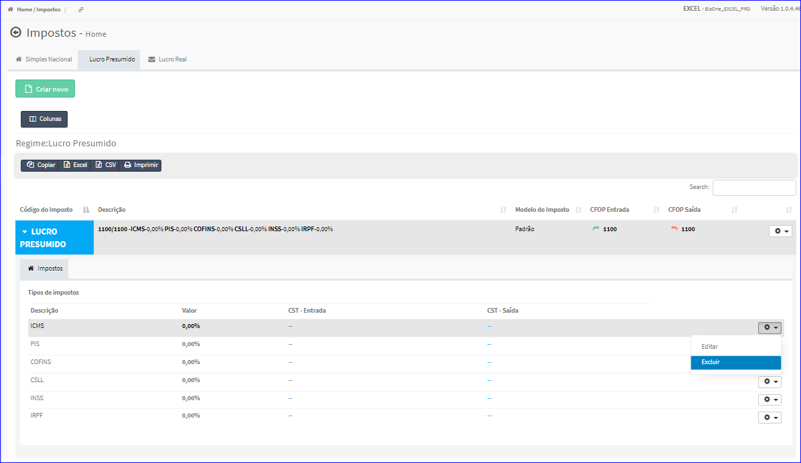
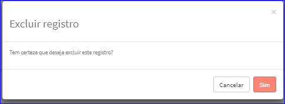

Tipos de Impostos - Lucro Presumido
###################################
* Ao selecionar um Imposto Lucro Presumido, o sistema automaticamente irá expandir a lista exibindo outra lista com os Tipos de Impostos vinculados.

|imagem27|

- **Editar Tipo de Imposto - Imposto Lucro Presumido**
   - Esta tela é chamada através da Lista dos Tipos de Impostos de um Imposto Lucro Presumido na tela principal do Cadastro.
   - Para isso, basta selecionar um Tipo de Imposto da Lista e ir até a Engrenagem situada à direita e escolher a opção **Editar**.

|imagem28|
   - Após o sistema irá abrir uma nova tela com o Tipo de Imposto escolhido anteriormente.

|imagem29|
|imagem30|
   - Nesta tela de edição, o usuário poderá editar os dados das operações de entrada e saída.

- Após alterados os dados e clicado em **Confirmar**, o sistema atualizará a lista.

- **Excluir Tipo de Imposto - Imposto Lucro Presumido**
   - Esta tela é chamada através da Lista dos Tipos de Impostos de um Imposto Lucro Presumido na tela principal do Cadastro.
   - Para isso, basta selecionar um Tipo de Imposto da Lista e ir até a Engrenagem situada à direita e escolher a opção **Excluir**.

|imagem31|
   - Após escolhido o Tipo de Imposto o sistema irá questionar o usuário quanto ao registro.

|imagem32|
   - Depois de clicado em **Sim** o sistema atualizará a lista.

