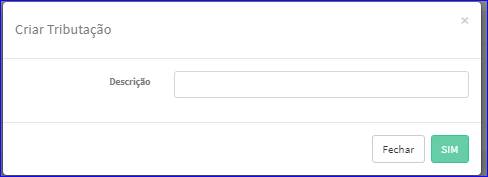

Criar Modelo Imposto
####################
- Permite a criação de um novo Modelo de Imposto.

- Essa opção é chamada através do botão **Criar Novo** da tela principal do Cadastro de Modelos de Impostos.

|imagem1|

- Após clicar no botão, o sistema irá abrir uma nova tela para a criação do cadastro.

|imagem3|
   * Após informado corretamente os dados e clicado em **SIM**, o sistema atualizará a lista dos Modelos de Impostos.

.. |imagem1| image:: imagens/Modelos_Impostos_1.png

